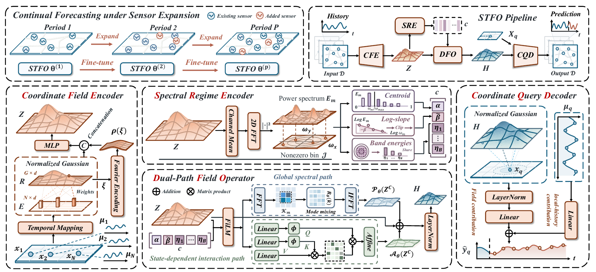

<a id="top"></a>

<div align="center">


### More Sensors Only One Field:<br>Rethinking Continual Spatio-Temporal Forecasting

**A shared field-evolution operator for forecasting with expanding sensor networks.**

[](requirements.txt)
[](requirements.txt)
[](#results)
[](https://github.com/Xielewei/Spatio-Temporal-Field-Operator/releases/tag/v1.0.0)

[🔎 Overview](#overview) &nbsp;·&nbsp; [📊 Results](#results) &nbsp;·&nbsp; [📦 Data](#data) &nbsp;·&nbsp; [🚀 Quick start](#getting-started) &nbsp;·&nbsp; [📝 Citation](#citation)

</div>

---

<a id="overview"></a>

## 🔎 Overview

This repository provides the PyTorch implementation of **STFO (Spatio-Temporal Field Operator)** and its main experiments on **PEMS-Stream**, **CA-Stream**, and **AIR-Stream**.

Sensor expansion changes the observations available about a process without necessarily changing its underlying dynamics. STFO learns forecasting knowledge on a shared latent field, using coordinate-based interfaces to incorporate observations and query predictions. The same parameter set is fine-tuned across periods without growing with the number of sensors.

<div align="center">

[](assets/overview.pdf)

<sub><b>STFO at a glance.</b> Click the framework to open the original vector PDF.</sub>

</div>

<details>
<summary><b>🧩 Explore the four model components</b></summary>

The model consists of four modules:

| Module | Role | Implementation |
| --- | --- | --- |
| **CFE** — Coordinate Field Encoder | Lifts sensor histories onto a fixed latent grid using normalized coordinate-based aggregation. | [cfe.py](src/model/stfo/cfe.py) |
| **SRE** — Spectral Regime Encoder | Summarizes variation across spatial scales to condition field evolution. | [sre.py](src/model/stfo/sre.py) |
| **DFO** — Dual-Path Field Operator | Combines Fourier propagation with state-dependent normalized attention. | [dfo.py](src/model/stfo/dfo.py) |
| **CQD** — Coordinate Query Decoder | Reads spatial corrections at sensor locations, combined with a local-history prediction branch. | [cqd.py](src/model/stfo/cqd.py) |

The complete model, including the local-history branch, is in [model.py](src/model/stfo/model.py).

</details>

<a id="results"></a>

## 📊 Results

STFO results from **Table 1** of the paper. Values are **mean ± standard deviation over three runs**, using the table's **Avg.** horizon setting. Lower is better; MAPE is in percent.

| Dataset | Model | MAE ↓ | RMSE ↓ | MAPE (%) ↓ |
| --- | --- | ---: | ---: | ---: |
| PEMS-Stream | STFO-S | 12.11 ± 0.02 | 20.04 ± 0.06 | 16.45 ± 0.11 |
| PEMS-Stream | STFO-M | 11.61 ± 0.03 | 19.20 ± 0.04 | 15.89 ± 0.09 |
| PEMS-Stream | STFO-L | **11.30 ± 0.03** | **18.76 ± 0.05** | **15.43 ± 0.09** |
| CA-Stream | STFO-S | 15.23 ± 0.02 | 25.83 ± 0.04 | 15.96 ± 0.05 |
| CA-Stream | STFO-M | 14.97 ± 0.07 | 25.47 ± 0.09 | 15.63 ± 0.05 |
| CA-Stream | STFO-L | **14.58 ± 0.03** | **24.91 ± 0.04** | **15.30 ± 0.00** |
| AIR-Stream | STFO-S | 20.01 ± 0.01 | 32.71 ± 0.05 | **27.90 ± 0.14** |
| AIR-Stream | STFO-M | **19.99 ± 0.08** | **32.61 ± 0.11** | 28.19 ± 0.22 |
| AIR-Stream | STFO-L | 20.06 ± 0.03 | 32.63 ± 0.07 | 28.36 ± 0.39 |

S, M, and L denote hidden widths of **32, 64, and 128**. Bold values identify the best STFO variant within each dataset and metric.

<a id="data"></a>

## 📦 Data

Download [**STFO_data.zip**](https://github.com/Xielewei/Spatio-Temporal-Field-Operator/releases/download/v1.0.0/STFO_data.zip) from the [data release](https://github.com/Xielewei/Spatio-Temporal-Field-Operator/releases/tag/v1.0.0). The archive is approximately **197 MiB** and contains **45 files across 15 periods**: time series, graphs, and aligned sensor metadata.

| Dataset | Periods | Configuration | Default model |
| --- | --- | --- | --- |
| PEMS-Stream | 2011–2017 (7 periods) | [STFO_PEMS.json](conf/STFO_PEMS.json) | STFO-L |
| CA-Stream | 0–3 (4 periods) | [STFO_CA.json](conf/STFO_CA.json) | STFO-L |
| AIR-Stream | 2016–2019 (4 periods) | [STFO_AIR.json](conf/STFO_AIR.json) | STFO-S |

From the repository directory:

```bash
curl -L --fail -o STFO_data.zip https://github.com/Xielewei/Spatio-Temporal-Field-Operator/releases/download/v1.0.0/STFO_data.zip
curl -L --fail -o SHA256SUMS.txt https://github.com/Xielewei/Spatio-Temporal-Field-Operator/releases/download/v1.0.0/SHA256SUMS.txt
sha256sum --check SHA256SUMS.txt
unzip STFO_data.zip -d .
```

For a private repository, authenticate with the GitHub CLI and download the release assets instead:

```bash
gh auth login
gh release download v1.0.0 --repo Xielewei/Spatio-Temporal-Field-Operator \
  --pattern STFO_data.zip --pattern SHA256SUMS.txt
sha256sum --check SHA256SUMS.txt
unzip STFO_data.zip -d .
```

This creates `data/PEMS/`, `data/CA/`, and `data/AIR/`. The first run builds the processed window cache automatically. To store the data elsewhere, pass `--data-root /path/to/data`; use `--cache-dir` to relocate the cache.

See [data format and preprocessing](docs/data.md) for file schemas, sensor alignment, coordinate construction, and split details.

<a id="getting-started"></a>

## 🚀 Getting started

### 1 · Set up the environment

Use **Python 3.11** in an isolated environment:

```bash
git clone https://github.com/Xielewei/Spatio-Temporal-Field-Operator.git
cd Spatio-Temporal-Field-Operator
python -m venv .venv
source .venv/bin/activate
python -m pip install -r requirements.txt
```

The main dependencies are PyTorch, PyTorch Geometric, NumPy, SciPy, NetworkX, and tqdm; version ranges are recorded in [requirements.txt](requirements.txt). GPU training requires a CUDA-enabled PyTorch installation. Use `--gpuid -1` for CPU execution.

### 2 · Train STFO

After downloading the data, run from the repository directory:

```bash
# PEMS-Stream
python main.py --conf conf/STFO_PEMS.json --size L --seed 42 --gpuid 0

# CA-Stream
python main.py --conf conf/STFO_CA.json --size L --seed 42 --gpuid 0

# AIR-Stream
python main.py --conf conf/STFO_AIR.json --size S --seed 42 --gpuid 0
```

To reproduce all STFO variants in Table 1, run each dataset with `--size S`, `--size M`, and `--size L`, and repeat each setting with seeds **42, 43, and 44**. Omitting `--size` uses the dataset defaults listed above. Other model and optimization settings are supplied by the dataset configuration.

<details>
<summary><b>⚙️ Training protocol and checkpoint selection</b></summary>

Each run trains on the first period and fine-tunes sequentially on subsequent periods. The protocol uses 12 history steps, 12 forecast steps, chronological 60%/20%/20% train/validation/test splits, AdamW, masked MAE, gradient clipping, and validation-based early stopping.

Checkpoint selection compares the best individual validation checkpoint with averages of up to three leading checkpoints. An average is accepted only when validation MAE improves by more than `0.0001`. Test data is used for final evaluation.

</details>

### 3 · Evaluate checkpoints

Re-evaluate the validation-selected checkpoints from a completed run:

```bash
python main.py --conf outputs/PEMS_STFO-L_seed42/config.json \
  --output outputs/PEMS_STFO-L_seed42 --evaluate --gpuid 0
```

Pass the same `--data-root` if the data is stored externally. Evaluation writes `evaluation.csv` and `evaluation.json` in the run directory.

<details>
<summary><b>📁 Output files and additional options</b></summary>

Training writes to `outputs/{dataset}_STFO-{size}_seed{seed}/`:

| File | Contents |
| --- | --- |
| `config.json` | Experiment configuration, including the seed. |
| `metrics.csv` | Period-level MAE, RMSE, and MAPE at horizons 3, 6, 12, and the average over all 12 horizons. |
| `metrics.json` | Period-level results and unweighted period means. |
| `{period}/checkpoint_soup.json` | Validation-based checkpoint selection for that period. |
| `{period}/*.pkl` | Training and selected model checkpoints. |

The run directory also contains the runtime log. Use `--output` for a different destination; training requires a new or empty output directory. `--workers` and `--epochs` override the corresponding configuration values. Run `python main.py --help` for all options.

</details>

<a id="repository-structure"></a>

## 🗂️ Repository structure

```text
Spatio-Temporal-Field-Operator/
├── main.py                 # Training and evaluation entry point
├── conf/                   # Three dataset configurations
├── src/
│   ├── model/stfo/         # CFE, SRE, DFO, CQD, and the complete STFO model
│   ├── data/               # Datasets, preprocessing cache, and sensor coordinates
│   └── trainer/            # Sequential training and checkpoint selection
├── utils/                  # Losses, metrics, preprocessing, and reproducibility
├── assets/                 # Framework overview
├── docs/                   # Data format and preprocessing details
└── requirements.txt        # Python dependencies
```

<a id="citation"></a>

## 📝 Citation

The paper is titled **More Sensors Only One Field: Rethinking Continual Spatio-Temporal Forecasting**. The arXiv link and BibTeX citation will be added when the preprint is available.

<a id="acknowledgments"></a>

## 🤝 Acknowledgments

We thank the authors of [**STBP**](https://github.com/Aoyu-Liu/STBP) for sharing their continual forecasting benchmark and implementation. Our continual data pipeline is adapted from their repository.

We also thank [**EAC**](https://github.com/Onedean/EAC) for making continual forecasting datasets and code available to the community, and the original dataset providers for their contributions.

---

<div align="center">

<sub>STFO · Spatio-Temporal Field Operator</sub><br>
[↑ Back to top](#top)

</div>
